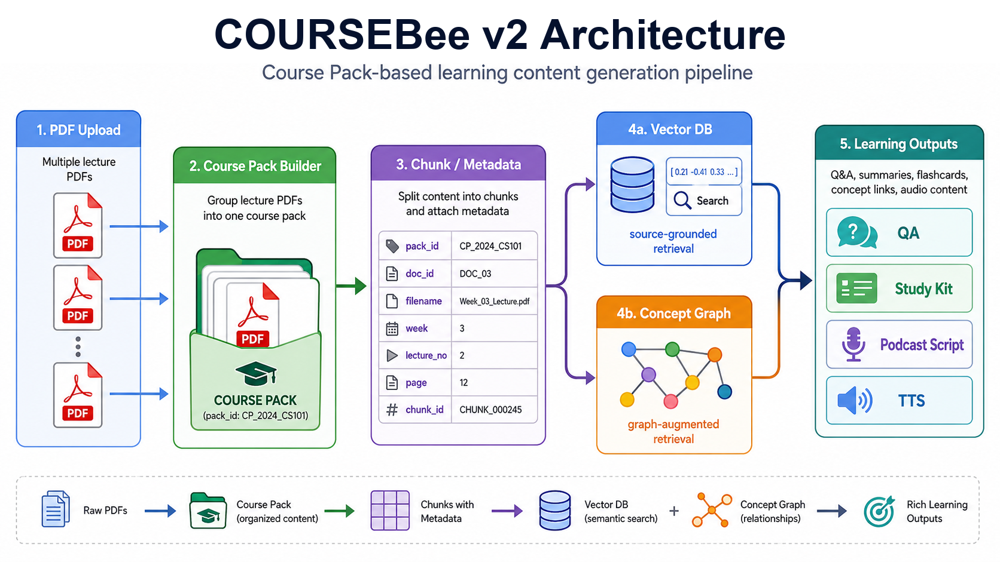

# CourseBee v2

CourseBee v2는 단일 PDF RAG 도구였던 BeePDF를 여러 강의자료 기반 Course Pack 학습 시스템으로 확장한 프로젝트입니다.

CourseBee는 여러 차시의 Learning Materials를 하나의 `Course Pack`으로 묶고, source metadata를 유지한 상태에서 Q&A, Study Kit, Concept Map, Podcast Script, TTS artifact를 생성하는 AI 학습 콘텐츠 생성 시스템입니다.



## Why CourseBee?

기존 단일 PDF RAG는 문서 하나 안의 질문에는 대응하기 쉽지만, 실제 강의 복습처럼 여러 차시 자료를 하나의 학습 단위로 묶어 이해하는 데는 한계가 있습니다.

CourseBee v2는 여러 강의자료를 하나의 Course Pack으로 묶고, 각 chunk에 `doc_id`, `filename`, `week`, `lecture_no`, `page`, `chunk_id`를 보존합니다. 이를 통해 답변과 학습 자료가 어떤 강의자료의 어떤 부분을 근거로 했는지 추적할 수 있습니다.

GraphRAG-lite는 full Microsoft GraphRAG가 아니라, Course Pack 내부의 concept edge와 evidence chunk를 retrieval에 활용하는 lightweight graph-augmented retrieval입니다.

## Key Features

- Multi-document Course Pack ingestion
- Source-grounded Q&A
- GraphRAG-lite `local_graph` retrieval
- Study Kit generation
- Concept Map generation
- Staged Podcast Script generation: `outline -> scene generation -> repair`
- Edge TTS artifact generation

## Demo Course Pack

- `pack_id`: `pack_static_nlp_11week_demo`
- Input: NLP 11주차 1~3차시 강의자료
- Output: Q&A, Study Kit, Concept Map, Podcast Script, Edge TTS mp3

원본 강의자료는 저작권 문제로 공개하지 않습니다. 포트폴리오에는 Course Pack 구조, source metadata 설계, 샘플 artifact, 실행 가능한 로컬 데모 코드만 포함합니다.

mp3 같은 큰 생성 artifact는 `outputs/` 경로에 직접 링크하지 않습니다. 공개 가능한 샘플만 필요한 경우 `assets/demo/` 아래에 별도로 둘 수 있습니다.

## Representative Outputs

### Source-grounded Q&A

```json
{
  "question": "BPE와 OOV는 어떤 관계야?",
  "mode": "local_graph",
  "answer": "BPE는 OOV 문제를 줄이기 위해 단어를 통째로 unknown 처리하지 않고 subword 조각으로 나누는 토큰화 방식입니다.",
  "sources": [
    {
      "doc_id": "doc_week11_1",
      "filename": "자연어처리_11주차_1차시.pptx",
      "page": 3,
      "chunk_id": "p3_c1"
    }
  ],
  "graph_context": [
    {
      "source": "BPE",
      "target": "OOV",
      "relation": "reduces",
      "evidence_chunk_id": "p3_c1"
    }
  ]
}
```

### Study Kit

```json
{
  "overview": "11주차 Course Pack은 BPE/OOV 문제에서 시작해 RNN, LSTM, CNN이 자연어처리 pipeline 안에서 어떤 역할을 하는지 연결해 설명합니다.",
  "flashcards": [
    {
      "front": "BPE는 OOV 문제를 어떻게 줄이는가?",
      "back": "단어를 subword 조각으로 나누어 처음 보는 단어도 기존 조각의 조합으로 처리하게 한다."
    }
  ],
  "expected_questions": [
    "BPE와 word-level tokenization의 차이는 무엇인가?",
    "RNN/LSTM과 CNN은 텍스트를 보는 방식이 어떻게 다른가?"
  ]
}
```

### Podcast Script

```text
HOST: 오늘은 NLP의 복잡한 용어들이 하나의 퍼즐처럼 연결되어 있다는 걸 알아보는 시간이에요.

GUEST: BPE, OOV, RNN, LSTM, CNN 같은 용어들이 각각 다른 분야처럼 보이지만, 사실은 AI가 텍스트를 읽는 과정에서 서로 연결된 단계를 이루고 있어요.
```

## v1 vs v2

| Area | v1 BeePDF | CourseBee v2 |
| --- | --- | --- |
| Main unit | Single PDF | Multi-document Course Pack |
| Goal | PDF-to-audio / document QA | Learning content generation from multiple lecture materials |
| Retrieval | Single-document RAG | Source-grounded retrieval across Course Pack chunks |
| Graph | None or visualization-focused | GraphRAG-lite `local_graph` retrieval using concept edges and evidence chunks |
| Output | Script / TTS centered | Q&A, Study Kit, Concept Map, Podcast Script, TTS artifact |
| Generation | Mostly one-shot | Staged orchestration: `outline -> scene generation -> repair` |
| Provenance | Page/chunk-level within one file | `doc_id`, filename, week, lecture_no, page, chunk_id across files |

## Quick Start

```bash
pip install -r requirements-v2.txt
uvicorn v2.main:app --reload --port 8000
```

Open:

```text
http://127.0.0.1:8000/docs
```

Example API call:

```bash
curl -X POST http://127.0.0.1:8000/v2/course-packs/ask \
  -H "Content-Type: application/json" \
  -d '{
    "pack_id": "pack_static_nlp_11week_demo",
    "question": "BPE와 OOV는 어떤 관계야?",
    "mode": "local_graph"
  }'
```

## Expected Endpoints

- `POST /v2/documents/ingest`
- `POST /v2/ask`
- `POST /v2/study-kit`
- `POST /v2/audio-script`
- `POST /v2/concept-map`
- `POST /v2/course-packs/ask`
- `POST /v2/course-packs/study-kit`
- `POST /v2/course-packs/audio-script`
- `POST /v2/course-packs/concept-map`

## Docs

- [CourseBee v2 Case Study](docs/coursebee-v2-case-study.md)
- [Architecture](docs/ARCHITECTURE.md)
- [GraphRAG-lite](docs/GRAPH_RAG.md)
- [v1 Legacy Overview](docs/V1_LEGACY.md)

More docs: [docs/README.md](docs/README.md)

## Tests

```bash
python -m unittest discover -s tests
```
