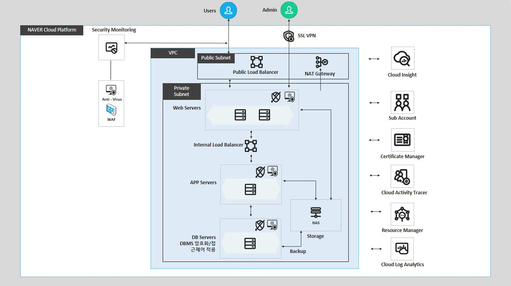
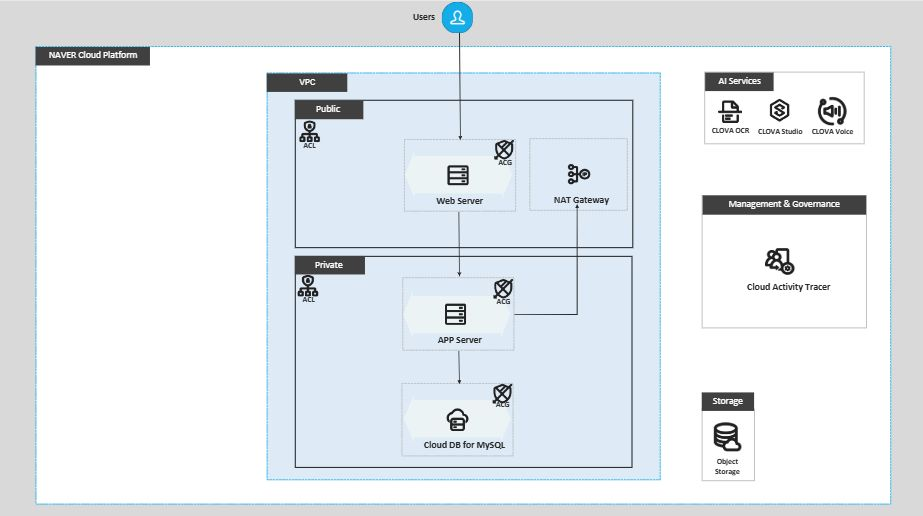
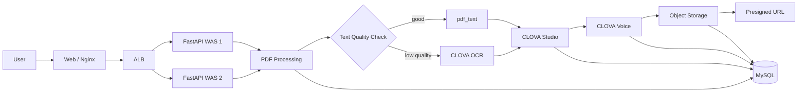

# BeePDF

PDF 문서를 업로드하면 텍스트 추출 또는 OCR, LLM 기반 대본 생성, TTS 음성 합성, Object Storage 배포까지 이어지는 문서 음성화 서비스입니다. 2주 개발 기간과 제한된 예산 안에서 운영 가능한 E2E 파이프라인을 설계하고, 비용 절감과 장애 추적이 가능한 구조로 확장했습니다.

## Overview

BeePDF는 PDF의 특성에 따라 처리 경로를 자동으로 선택합니다. 텍스트 레이어가 있는 PDF는 로컬 텍스트 추출 경로를 우선 사용하고, 스캔 PDF처럼 추출 품질이 낮은 파일은 OCR로 폴백합니다. 이후 CLOVA Studio로 자연스러운 대본을 생성하고, CLOVA Voice로 MP3를 만든 뒤 Object Storage에 저장해 Presigned URL로 제공합니다.

## v2 Upgrade Direction

BeePDF v2는 기존 PDF 음성화 파이프라인을 source-grounded RAG, GraphRAG-lite, LangGraph-style workflow, cloud-ready provider 구조로 확장합니다.

### Phase 1. Source-grounded RAG

- PyMuPDF4LLM 또는 Docling으로 PDF를 page markdown으로 변환
- `chunk_id`, `page_number`를 유지한 page chunk 생성
- FAISS 또는 Chroma 기반 chunk 검색
- 답변과 함께 source page citation 반환

산출물:

- `/v2/ask`
- `/v2/summary`
- `outputs/{doc_id}/chunks.json`
- `outputs/{doc_id}/answer_with_sources.json`

### Phase 2. LangGraph-style Workflow

기존 순차 처리 코드를 node 단위로 분리하고, mode별 workflow를 구성합니다.

- `summary_mode`
- `qa_mode`
- `study_kit_mode`
- `audio_script_mode`
- `graphrag_mode`

주요 노드:

- `parse_pdf_node`
- `ocr_fallback_node`
- `chunk_node`
- `vector_index_node`
- `graph_index_node`
- `rag_answer_node`
- `graphrag_answer_node`
- `script_generation_node`
- `citation_check_node`
- `export_node`

### Phase 3. GraphRAG-lite

처음부터 Microsoft GraphRAG 전체 구조로 가지 않고, PDF 관계 분석에 필요한 lite 구조를 적용합니다.

```text
chunk
→ entity extraction
→ relation extraction
→ NetworkX graph
→ entity neighbor retrieval
→ vector result + graph context
```

예시 출력:

```json
{
  "answer": "BeePDF의 비용 절감은 OCR 호출 최소화와 sha256 캐시를 중심으로 설계됩니다.",
  "vector_sources": [
    {"page": 3, "chunk_id": "p3_c2"}
  ],
  "graph_context": [
    ["sha256 cache", "reduces", "repeated processing cost"],
    ["OCR fallback", "handles", "scanned PDFs"]
  ]
}
```

### Phase 4. Study Kit & Audio Script

- 요약
- 용어집
- 퀴즈
- 예상 질문
- 발표 대본
- 1분, 3분, 5분 음성 대본

### Phase 5. Cloud-ready Design

v2는 비용 문제로 로컬 실행을 기본값으로 두었지만, Storage/LLM/TTS/Index 계층을 provider interface로 분리하여 클라우드 Object Storage, 외부 LLM API, managed vector DB로 교체 가능한 cloud-ready 구조로 설계했습니다.

자세한 설계는 `docs/ARCHITECTURE.md`, `docs/WORKFLOW.md`, `docs/PROVIDERS.md`, `docs/GRAPH_RAG.md`, `docs/CLOUD_READY_PLAN.md`, `docs/EVALUATION.md`에 정리했습니다.

## 과업지시서 기반 아키텍처



1차 과제의 과업지시서 요구사항인 Web 2대, WAS 1대, DB 1대, NAS 500GB, LB, SSL VPN, WAF, 모니터링/로그 분석 구성을 반영한 NCP 3-Tier 아키텍처입니다.

## Service Pipeline



BeePDF는 Nginx 기반 Web 계층, ALB 뒤의 FastAPI App Server, Cloud DB for MySQL, Object Storage, CLOVA OCR/Studio/Voice를 연결해 PDF 업로드부터 MP3 생성과 배포까지 처리합니다.



## Key Features

- PDF 업로드 후 텍스트 추출, OCR, 대본 생성, TTS, 저장까지 이어지는 E2E 파이프라인
- `pdf_text` 우선 처리 후 품질 기준에 따라 OCR로 자동 폴백
- PDF 바이너리 `sha256` 기반 캐시로 동일 파일 재처리 비용 절감
- `force_regen` 옵션으로 캐시 재사용과 강제 재생성 흐름 분리
- `request_id` 기반 요청 추적과 단계별 로깅으로 장애 지점 확인
- MP3 결과물을 Object Storage에 저장하고 Presigned URL로 만료 기반 공유
- WAS 이중화와 ALB 헬스체크로 장애 서버 제외 및 트래픽 분산
- Cloud DB for MySQL HA 구성과 Failover 검증으로 DB 가용성 강화

## Architecture

### Web

- Nginx로 정적 페이지를 제공
- `/v1/*` 요청을 FastAPI WAS로 리버스 프록시
- HTTPS 종료 지점을 Web 계층에 두어 인증서 관리를 단순화

### Application

- FastAPI 기반 PDF 처리 API
- OCR, Studio, Voice 같은 외부 API 호출 구간을 WAS 계층에서 수행
- WAS 2대와 ALB를 구성해 수평 확장과 장애 우회를 고려

### Database

- MySQL에 요청 단위 로그와 단계별 실행 결과를 저장
- `request_id`로 요청 흐름을 추적
- `request_steps`에 `OK`, `FAIL`, `SKIP`, 지연시간, 에러 메시지를 기록
- Cloud DB HA 구성으로 Master, Standby Master 전환 테스트 수행

### Storage

- 생성된 MP3 파일을 Object Storage에 저장
- 사용자에게는 Presigned URL을 제공해 시간 제한 기반 접근을 지원

## Processing Flow

1. 사용자가 PDF를 업로드합니다.
2. 서버가 PDF 바이너리 해시를 계산해 캐시 여부를 확인합니다.
3. `force_regen=0`이고 캐시 HIT이면 후속 외부 호출을 생략합니다.
4. 캐시 MISS 또는 `force_regen=1`이면 전체 파이프라인을 실행합니다.
5. 먼저 PDF 텍스트를 추출하고 품질 점수를 계산합니다.
6. 품질 기준을 만족하면 `pdf_text` 결과를 사용하고, 기준 미달이면 OCR로 폴백합니다.
7. 추출된 텍스트를 CLOVA Studio에 전달해 대본을 생성합니다.
8. CLOVA Voice로 MP3를 생성합니다.
9. Object Storage에 저장한 뒤 Presigned URL을 반환합니다.
10. 모든 단계의 상태와 지연시간을 DB에 기록합니다.

## Text Extraction Strategy

텍스트 레이어 PDF를 무조건 OCR로 처리하면 불필요한 외부 호출 비용과 지연시간이 발생합니다. 반대로 스캔 PDF를 단순 텍스트 추출로만 처리하면 결과 품질이 깨질 수 있습니다. 이를 해결하기 위해 다음 기준으로 처리 경로를 선택했습니다.

- 공백 제외 최소 글자 수 200자 이상
- 한글 비율 0.05 이상
- 깨짐 문자 비율 0.01 이하

위 기준을 만족하면 `pdf_text` 경로를 채택하고, 실패하거나 품질이 낮으면 OCR로 폴백합니다.

## Cache And Observability

동일 PDF를 반복 처리할 때 OCR, Studio, TTS 호출을 매번 수행하면 비용과 시간이 낭비됩니다. BeePDF는 PDF 바이너리의 `sha256` 해시를 캐시 키로 사용해 이전 결과를 재사용합니다.

- `force_regen=0`: 캐시를 먼저 조회하고 HIT이면 후속 단계 SKIP
- `force_regen=1`: 캐시 조회를 SKIP하고 전체 파이프라인 강제 실행
- `request_id`: 요청 단위 추적 키
- `request_steps`: 단계별 상태, 지연시간, 에러 기록

캐시 HIT 시 외부 API 호출을 생략해 처리 시간을 줄이고, 장애 발생 시에는 `request_id` 하나로 실패 단계가 `OCR`, `STUDIO`, `VOICE`, `STORE` 중 어디인지 빠르게 확인할 수 있습니다.

## Validation

- 텍스트 레이어 PDF와 스캔 PDF를 각각 업로드해 `method=pdf_text`, `method=ocr` 분기를 확인
- 동일 PDF를 `force_regen=0`으로 2회 요청해 두 번째 요청에서 캐시 HIT와 후속 단계 SKIP 확인
- `force_regen=1` 요청에서 캐시를 건너뛰고 전체 파이프라인 재실행 확인
- `request_id` 기반으로 단계별 성공, 실패, 지연시간, 에러 메시지 추적 확인
- App Server 이중화 후 ALB 헬스체크와 장애 서버 제외 흐름 검증
- Cloud DB for MySQL HA 구성 후 콘솔 수동 Failover 검증

## Cost Optimization

- 텍스트 레이어 PDF는 OCR 호출을 생략해 처리 비용과 지연시간을 줄임
- 캐시 HIT 시 OCR, Studio, Voice, Store 단계를 생략해 반복 요청 비용을 절감
- MP3 파일은 Object Storage에 저장하고 Presigned URL로 공유해 서버 부하를 줄임
- 초기에는 단일 구성으로 비용을 고정하고, 잔여 예산을 활용해 WAS 이중화와 ALB 검증을 수행

## Future Improvements

- 긴 작업을 HTTP 요청 안에서 모두 처리하지 않고, 접수와 처리를 분리하는 비동기 Job 구조로 개선
- `request_id` 기반 상태 조회 API를 제공해 `PENDING`, `RUNNING`, `DONE`, `FAIL` 상태 확인
- 캐시 조회를 인메모리 저장소로 분리해 DB 부하 감소
- 캐시 키에 모델, 보이스, 프롬프트 버전 등 처리 옵션을 포함해 재사용 정확도 향상
- 상세 로그는 로그 분석 도구로 분리하고 DB에는 최종 상태와 핵심 메타만 저장
- 정적 페이지를 별도 정적 호스팅으로 분리하거나 Web 서버를 다중화해 단일 장애점 완화

## Tech Stack

- Backend: FastAPI
- Web: Nginx, Reverse Proxy
- Database: MySQL, Cloud DB HA
- Storage: Object Storage, Presigned URL
- AI: CLOVA OCR, CLOVA Studio, CLOVA Voice
- Infra: NCP VPC, Subnet, ACG, NAT Gateway, ALB, SSL VPN, WAF, Cloud Activity Tracer
