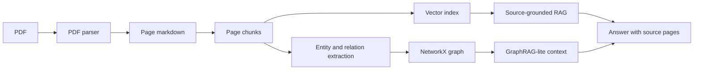

# BeePDF v2 Architecture

BeePDF v2 upgrades the original PDF-to-audio pipeline into a source-grounded document intelligence system. The goal is not to attach GraphRAG as a buzzword, but to solve the concrete problem of retrieving page-level evidence and lightweight document relationships from uploaded PDFs.

## Layers

1. Document parser
2. Chunking and page metadata
3. Vector RAG
4. GraphRAG-lite
5. LangGraph-style workflow orchestration
6. Cloud-ready provider adapters

## High-level Flow

## Core Artifacts

- `outputs/{doc_id}/chunks.json`
- `outputs/{doc_id}/answer_with_sources.json`
- `outputs/{doc_id}/graph.json`
- `outputs/{doc_id}/concept_map.json`

## API Targets

- `/v2/ask`
- `/v2/summary`
- `/v2/graph/build`
- `/v2/graph/query`
- `/v2/concept-map`

## Why GraphRAG-lite

Full Microsoft GraphRAG is powerful but heavy for this portfolio scope. BeePDF v2 uses a lighter pattern:

- Extract entities and relations from chunks.
- Store them in a NetworkX graph.
- Retrieve entity neighbors related to the question.
- Combine graph context with vector search results.

This keeps the implementation explainable, cheap to run, and aligned with PDF relationship analysis.
